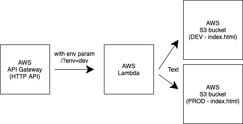

# Author

Robert Polakovic

# Project

This is my simple Terraform project. The goal was to learn Terraform and how it interacts with AWS. I wanted to build a simple application/workflow on AWS free tier using Terraform.

Because this is a sample, public repository, I put a lot of inline comments into the code to explain it.

## Note

The project is still in progress and I want to add more features in the future. I havent really managed to implement everything I wanted because of other projects I had to work on.

## How to test the project

1. go to **https://wocdgm16tb.execute-api.eu-central-1.amazonaws.com/?env=dev** and change the "env" variable to "dev" or "prod"
2. open the link specified on the webpage above (https://my-taget-bucket-dev.s3.eu-central-1.amazonaws.com/index.html or https://my-taget-bucket-prod.s3.eu-central-1.amazonaws.com/index.html)

## Tech stack

1. Terraform + python code
2. GitHub actions for CI/CD 
3. Terraform Cloud for better integration with GitHub (used for storing Terraform state etc.)
4. AWS as the main technology

## Project structure

1. AWS API Gateway - new API
2. Lambda for processing requests and generate response
3. S3 - index.html containing the Lambda's response

### API Gateway

API Gateway was used for creating really simple HTTP API. It is integrated with the Lambda function.

### Lambda

The Lambda function expects an "env" (either "dev" or "prod") param in the request (URL). Business logic implemented
- based on the "env" param it decides what is the target S3 bucket
- deletes everything inside the target bucket
- generates new content
- createa a new "index.html" file inside the target bucket

### S3

There are 2 buckets created (dev & prod). Both are publicly available and flagged as "web" buckets.

## Deployment process

I am using Terraform Cloud for better integration with GitHub actions and AWS. 
States and plans are stored in Terraform Cloud.

The workflow is: GitHub actions -> Terraform Cloud -> AWS

How deployemnt works in a nutshell:

- I am using GitHub actions for running my CI/CD workflow
- Terraform Cloud account is used for storing Terraform state files and plans
- AWS credentials are stored in Terraform Cloud account (GitHub uses only Terraform Cloud credentials)
- Terraform deployes AWS resources

## Limitations

### tfvars

Tfvars are great for storing enviroment specific variables but I could not make tfvars work with GitHub Actions.

This seems like a common problem:

https://stackoverflow.com/questions/65329699/switching-terraform-cloud-workspaces-in-github-actions-terraform-cli
https://stackoverflow.com/questions/66680460/is-there-a-way-in-terraform-enterprise-to-read-the-payload-from-vcs/66770918#66770918

I am sure I would brake this problem having more time.